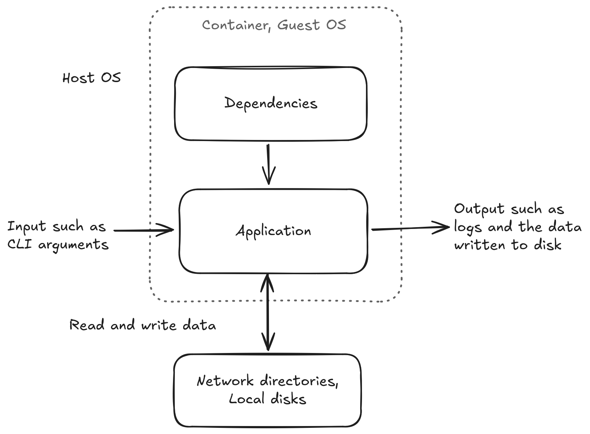

# Guidelines for containerizing scientific applications for HPC clusters
## Introduction
These guidelines provide general principles and concrete examples for containerizing scientific applications used in HPC clusters.
This contrasts with containers for network applications used in cloud environments.
We assume basic knowledge of the Linux operating system, shell scripting, and software building and installation on Linux.

A scientific application consists of the application software and various software dependencies.
We assume that the application has a [command line interface](https://clig.dev/) and can be configured via command line options, environment variables, configuration files, or a combination of these.
Our focus is on scientific applications that run as batch processes on HPC clusters, reading input data from input files and writing output data to output files.

We assume that the application is developed using a version control system, such as Git, and follows a systematic versioning scheme, such as [Semantic Versioning](https://semver.org/), to install a specific version of the software.
Additionally, we assume that the source code is hosted and software releases are available on the web, using platforms like GitHub or GitLab, enabling easy download.

Apptainer is the primary technology used to run and build containers for HPC clusters.
Formerly known as Singularity, it was renamed Apptainer when it moved under the Linux Foundation.
Sylabs maintains a fork of Singularity named SingularityCE, which has minor implementation differences compared to Apptainer.
The command line interfaces of Apptainer and Singularity are similar and can be used interchangeably.

Furthermore, Docker can be used to build Docker containers, and Podman can be used to build OCI containers that run on HPC clusters using Apptainer.
Internally, Podman uses Buildah to build [OCI](https://opencontainers.org/) containers, and it is possible to use Buildah directly if necessary.

We build on top on the excellent [Apptainer documentation](https://apptainer.org/docs/user/main/index.html).
We also take inspirationsl from [Octave's dockerfiles](https://github.com/gnu-octave/docker) which provide great example of HPC compatible containers of a complex scientific application.


## Containerized application


The above figure illustrates a scientific application and its dependencies.
When running a software normally without a container the application is installed to some user directory and the depedencies may come from system or user installed locations.

The dashed line indicates the parts that are "containerized" when using a software container.
Application and its dependencies are installed into the container.
Directories that are outside of the container such as network directories and local disk must be bind mounted to the container to make them accessible from the container.
Containerized software is invoked via a container runtime such Apptainer or Singularity.
The host and guest OS can be different.


## Reasons to use containers on HPC clusters
Using containers on HPC clusters improve portability, consistency, reproducibility, and dependency management of scientific applications.
By packaging applications and their dependencies, containers ensure consistent execution across different environments, reducing "works on my machine" issues and facilitating the movement of workloads between systems.
This containerization approach greatly enhances reproducibility in scientific research, allowing researchers to share exact experimental environments and replicate results more easily.
Additionally, containers effectively manage dependencies by encapsulating all necessary libraries, eliminating conflicts between software versions or incompatible libraries.
This is particularly beneficial in multi-user HPC environments where diverse software requirements are common.

Containers also reduce the load to the parallel file system on HPC clusters.
Apptainer encapsulates entire software environments into single, compressed file, drastically reducing the number of files and disk space used on the parallel file system.
Also, loading single large file requires fewer file system operations leading to faster startup time and less burden on the parallel file system.


## General principles
We break down containerization into three acticities:

1. Defining and building containers of scientific applications for HPC clusters.
2. Running scientific applications from containers on HPC clusters.
3. Managing container definitions, images and build processes.

We will discuss the general principles and provide concrete examples for each of these activities.


### Defining and building containers
We define containers using definition files.
Container definitions should explicitly define all software dependencies to ensure reproducibility.

| Base image | Package manager |
| - | - |
| [ubuntu](https://hub.docker.com/_/ubuntu) | APT |
| [debian](https://hub.docker.com/_/debian) | APT |
| [opensuse/leap](https://hub.docker.com/r/opensuse/leap) | Zypper |
| [rockylinux](https://hub.docker.com/_/rockylinux) | DNF |
| [centos](https://hub.docker.com/_/centos) | DNF |
| [almalinux](https://hub.docker.com/_/almalinux) | DNF |
| [redhat/ubi8](https://hub.docker.com/r/redhat/ubi8) | DNF |
| [redhat/ubi9](https://hub.docker.com/r/redhat/ubi9) | DNF |
| [E4S](https://e4s-project.github.io/download.html) | Spack |

The table below contains recommendations for keeping containers simple, extensible, and compatible with Apptainer, Docker, and OCI containers.
We can define containers for Docker and Podman using the Dockerfile format.

| [Apptainer](https://apptainer.org/docs/user/main/definition_files.html) | [Dockerfile](https://docs.docker.com/reference/dockerfile/) | Recommendation |
| - | - | - |
| `.def` | `.dockerfile` | File extension to use for the definition file. Avoid using plain `Dockerfile` because complex applications may require multiple definition files. |
| `From` | `FROM` | Use normally |
| `Bootstrap` | - | Use normally |
| `%post` | `RUN` | Use normally to run shell commands with `/bin/sh` to build the container. |
| `%environment` | `ENV` | Use to define runtime environment variables |
| `%arguments` | `ARG` | We can use build arguments to specify default software versions when changing the version does not require adding control flow to the build scripts. We can override default values using the `--build-arg` flag for the build command. |
| `%labels` | `LABEL` | Add metadata to container as name-value pairs. |
| `%files` | `COPY` | Avoid copying files from host to container. Instead download dependencies via the network in `%post` or `RUN`. |
| `%runscript`, `%startscript` | `CMD`, `ENTRYPOINT` | Avoid using runscripts. Instead, use `apptainer exec` to explictly run commands. |
| - | `USER` | Do not use. It can lead to access permission issues. |
| - | `SHELL` | Do not use. It is not part of OCI specification. |

It is best to avoid other keywords to keep containers simple and easier to convert to OCI container definitions which we discuss later.

Inside the container, software is installed as the root user, therefore we don't need to use the `sudo` command.
We should install all software to system locations.
The following table explains our options where to install software.

| Directory | Recommendation |
| - | - |
| `/usr` | Default directory where package managers install software. Executables and libraries are on the path by default. |
| `/usr/local` | We can install software to `/usr/local`. Executables and libraries are on the path by default. |
| `/opt` | We can install software to `/opt` but it requires modifying `PATH` and `LD_LIBRARY_PATH` for build and runtime. |
| `/tmp` | Use `/tmp` for temporary files during the build process and ensure these files are removed after the build completes. Apptainer mounts it at runtime by default. |
| `/home`, `/root` | Do not create files to the home directories. Apptainer mounts them at runtime by default. |

Given installation directory `$PREFIX`, the convention is to place executables to `$PREFIX/bin` directory, shared libraries to `$PREFIX/lib` directory, configurations `$PREFIX/etc` and headers to `$PREFIX/include`.
Ensure all installed files are world-readable.
For more details about Linux file system convetions, see [File Hierarchy Standard (FHS)](https://en.wikipedia.org/wiki/Filesystem_Hierarchy_Standard).

In HPC environments, we should point Apptainer cache and temporary directories to a sane location by setting the `APPTAINER_CACHEDIR` and `APPTAINER_TMPDIR` environment variables.
For example, we can set cache directory to a shared location if we are working in a project and temporary directory to fast local disk.

We can build apptainer containers using `apptainer build`.
We can build containers using `docker build` and `podman build`.


### Running containers
We run commands within the container using the `apptainer exec` command as follows:

```sh
apptainer exec <flags> app.sif <command> <arguments>
```

We can use `--env` flag to set environment variables and `--cleanenv` to avoid passing environment variables from the host.
For bind mounts, we can use `--bind` to bind mount directories and `--no-home` to disable binding home directory.

The container filesystem is read-only at runtime, therefore, make sure that your program does not attempt to write files to the container at runtime.
Instead, write files to the bind mounted directories with write permission.
Bind mounts have read and write permission by default when permissions are not defined explicitly.
Input data is read from and output is written into bind mounted directories.
Apptainer will bind mount certain directories by default such as the home directory (`$HOME`), current working directory and the temporary directory (`/tmp`).


### Managing containers
We should place container definitions into a separate repository instead of placing them to the same repository as the application source code.
The separation makes the separation between the application source code and the container definitions explicit.

<!--
- version controlling container definitions
- versioning containers
- storing containers into container registry
- automatically building containers.
-->


## Example: Containerizing a scientific application
In the following examples, we demonstrate how to create and run a container for a small scientific application called [sciapp](https://github.com/jaantollander/sciapp).
We demonstrate Apptainer, Docker and Podman.
We install the dependencies to run and build `sciapp` and them we install `sciapp` itself by building it from the source.
We also show how to push and pull container images to a container registry such as [GitHub Container Registry](https://docs.github.com/en/packages/working-with-a-github-packages-registry/working-with-the-container-registry)


### Apptainer
Let's start by writing the following Apptainer definition to `app.def` file:

```sh
Bootstrap: docker
From: ubuntu:22.04

%post
    # Install dependencies for building and running sciapp
    export DEBIAN_FRONTEND=noninteractive && \
    apt-get --yes update && \
    apt-get --yes upgrade && \
    apt-get --yes --no-install-recommends install \
        ca-certificates \
        curl \
        tar \
        gzip \
        bash \
        gcc \
        make \
        libc6-dev \
        && \
    apt-get --yes clean && \
    apt-get --yes autoremove && \
    rm -rf /var/lib/apt/lists/*

    # Install sciapp
    SCIAPP_VERSION=0.2.0 && \
    SCIAPP_URL=https://github.com/jaantollander/sciapp/archive/refs/tags/v${SCIAPP_VERSION}.tar.gz && \
    mkdir -p /tmp/build && \
    cd /tmp/build && \
    curl --location --output sciapp.tar.gz ${SCIAPP_URL} && \
    tar -xf sciapp.tar.gz && \
    cd sciapp-${SCIAPP_VERSION} && \
    make && \
    make install PREFIX=/usr/local && \
    cd / && \
    rm -rf /tmp/build
```

Next, we build the container as follows:

```sh
apptainer build app.sif app.def
```

Once the container is built, we can test it.
Let's create an input file `input.txt` with the following lines:

```text
1.0
2.0
3.0
```

Let's run the containerized application and supply path to the input and output files as arguments.

```sh
apptainer exec app.sif sciapp input.txt output.txt
```

If everything worked correctly, the application produces an output file `output.txt` with the following output:

```text
Average: 2.00
```

We can store Apptainer images to container registries that support [ORAS](https://oras.land/) such as GitHub Container Registry as follows:

```sh
apptainer registry login --username <username> oras://ghcr.io  # will prompt for an access token
apptainer push app.sif oras://ghcr.io/<username>/app:0.2.0
```

We can pull the container with Apptainer as follows:

```sh
apptainer pull app.sif oras://ghcr.io/<username>/app:0.2.0
```

In the next examples, we build Docker container and OCI container with Podman for the same application and convert it to Apptainer container.


### Docker
Let's start by writing the following Dockerfile to `app.dockerfile` file:

```dockerfile
FROM ubuntu:22.04

# Install dependencies for building and running sciapp
RUN export DEBIAN_FRONTEND=noninteractive && \
    apt-get --yes update && \
    apt-get --yes upgrade && \
    apt-get --yes --no-install-recommends install \
        ca-certificates \
        curl \
        tar \
        gzip \
        bash \
        gcc \
        make \
        libc6-dev \
        && \
    apt-get --yes clean && \
    apt-get --yes autoremove && \
    rm -rf /var/lib/apt/lists/*

# Install sciapp
RUN SCIAPP_VERSION=0.2.0 && \
    SCIAPP_URL=https://github.com/jaantollander/sciapp/archive/refs/tags/v${SCIAPP_VERSION}.tar.gz && \
    mkdir -p /tmp/build && \
    cd /tmp/build && \
    curl --location --output sciapp.tar.gz ${SCIAPP_URL} && \
    tar -xf sciapp.tar.gz && \
    cd sciapp-${SCIAPP_VERSION} && \
    make && \
    make install PREFIX=/usr/local && \
    cd / && \
    rm -rf /tmp/build
```

Next, we build the container with Docker as follows:

```sh
docker build --tag localhost/app:0.2.0 --file app.dockerfile .
```

We can converting the Docker image into Apptainer image by saving the Docker image into an archive and building the Apptainer image from the archive as follows:

```sh
docker save --output app.tar localhost/app:0.2.0
apptainer build app.sif docker-archive://app.tar
```

Now, we can test that the container works as expected in the same way as in the Apptainer example.

Finally, we can push the container image to a container registry.
For example, we can use GitHub Container Registry (GHCR) as follows:

```sh
docker login --username <username> ghcr.io  # will prompt for an access token
docker localhost/app:0.2.0 ghcr.io/<username>/app:0.2.0
docker push ghcr.io/<username>/app:0.2.0
```

We can pull the container with Apptainer as follows:

```sh
apptainer pull app.sif docker://ghcr.io/<username>/app:0.2.0
```


### Podman
We use the Dockerfile that we defined in the Docker example.
We can build the container with Podman as follows:

```sh
podman build --tag localhost/app:0.2.0 --file app.dockerfile .
```

We can converting the OCI image into Apptainer image by saving the OCI image into an archive and building the Apptainer image from the archive as follows:

```sh
podman save --output app.tar localhost/app:0.2.0
apptainer build app.sif docker-archive://app.tar
```

Finally, we can push the container image to a container registry.
For example, we can use GitHub Container Registry (GHCR) as follows:

```sh
podman login --username <username> ghcr.io  # will prompt for an access token
podman tag localhost/app:0.2.0 ghcr.io/<username>/app:0.2.0
podman push ghcr.io/<username>/app:0.2.0
```

We can pull the container with Apptainer as follows:

```sh
apptainer pull app.sif docker://ghcr.io/<username>/app:0.2.0
```

<!--
## Working with containers on HPC clusters
Building and running container, cache location, bind mounts, fakeroot
-->
